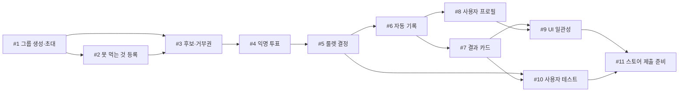

# 5주차 활동지 / Week 5 Worksheet

**1-page 기획서 / One-page plan**

- 작성일 / Date: 09.30
- 참여자 / Present: 황병주 이재곤 이학준 이혁준

---

## ① 주제 확정 / Confirm topic

- 확정 주제 / Topic: BapBTI(가명), "밥" 에 대한 개인의 취향을 담은 프로필.
- 이유 / Reason: 
  4 주차에는 킥보드 통합 플랫폼을 골랐으나, 다른 아이디어로 변경했다. 이유->
  1. 킥보드는 각 사업자의 실시간 위치·결제 API가 있어야 성립하는데, 제휴 없이는 받을 수 없다. 15주차 발표장에서 시연할 수 없는 형태다.
  2. 밥비티아이는 외부 의존이 없다. 우리가 만든 데이터와 우리 서버만으로 입력부터 결과까지 끝까지 동작한다.
  3. "뭐 먹지"의 진짜 병목은 정보 부족이 아니라 고른 사람이 책임지기 싫은 것이다. 우리 해법은 추천이 아니라 책임 흡수(룰렛이 골랐다)이고, 여기에 기존 메뉴 룰렛 앱들과의 차이가 있다 — 결정이 1회성으로 끝나지 않고 기록으로 남는다.

---

## ② 태스크 분해와 의존 관계 / Tasks and dependencies

### 태스크 목록 / Task list

4주차 사용자 스토리와 완료 조건을 태스크로 나눕니다.
*Break down your Week 4 user stories and acceptance criteria into tasks.*

각 태스크는 따로 끝내도 맞는지 확인할 수 있어야 합니다. 담당에 '다 같이'는 쓰지 않습니다.
*Each task must be checkable on its own. Do not write "everyone" as owner.*

| #   | 태스크 Task           | 완료 조건 Done when                                            | 선행 태스크 Depends on | 담당 Owner |
| --- | ------------------ | ---------------------------------------------------------- | ----------------- | -------- |
|     | 사용자 프로필 생성         | 선호 음식 지정 시 선호 음식 정보들이 사용자 정보 내 저장 되는가                      |                   | 황병주      |
|     | 사용자 프로필 구성         | 사용자 전체 정보 및 선호 음식 프로필 표시                                | 프로필 생성            | 이재곤      |
|     | 그룹방 구성             | 여러 사용자 명단 표시                                               | 프로필 구성            | 이학준      |
|     | 여러 사용자들의 프로필 취합 기능 | 명단 내 사용자들의 선호 음식을 모아서 표시                                | 프로필 생성            | 이혁준      |
|     | 음식 투표 및 코멘트 기능  | 선호 음식 투표 시 투표한 음식 순위대로 표시, 사용자가 음식 투표란에 코멘트를 달면 해당 코멘트를 표시 | 그룹방 구성            | 이학준      |

### 의존 관계 그래프 / Dependency graph (DAG)

화살표는 "앞 태스크가 끝나야 뒤 태스크를 할 수 있다"는 뜻입니다.
*An arrow means the first task must finish before the second can start.*

**그리는 방법 / How to draw**
- 아래 예시에서 상자 이름을 바꾸고, 선후 관계 하나마다 화살표(`-->`) 줄을 하나씩 추가합니다. GitHub에서 파일을 열면 그림으로 보입니다. 미리 보려면 mermaid.live에 붙여 넣으세요.
  *Rename the boxes and add one `-->` line per dependency. GitHub shows it as a diagram. Preview at mermaid.live.*
- 태스크 표를 AI에게 주고 "Mermaid 그래프로 바꿔 줘"라고 요청해도 됩니다.
  *You can also give the task table to AI and ask "Convert this into a Mermaid graph."*
- 어려우면 종이에 그려 사진을 `docs/images/`에 올리고 ``로 넣어도 됩니다.
  *Or draw it on paper, upload the photo to `docs/images/` and link it with ``.*

- 지금 착수 가능 (진입 차수 0) / Can start now (in-degree 0): 
- 작업 순서 (위상정렬) / Work order (topological sort): 
- 사이클이 있었다면 어떻게 풀었는가 / If there was a cycle, how did you fix it?: 

---

## ③ 범위 결정 / Scope

### Must — 없으면 성립 안 됨 / essential

핵심 시나리오 1개가 끝까지 동작하는 데 필요한 것만 / *Only what the core scenario needs to work end-to-end*

- 핵심 시나리오 / Core scenario:  각자의 프로필을 생성하고, 공유하여 서로간의 이해와 메뉴 선정에 도움을 준다.

### Should (없을 경우에는 작성하지 마세요)

- UI 일관성 — 감성이 제품의 일부이므로 마지막에 한 번에 정리한다. 

### Could (없을 경우에는 작성하지 마세요)

- 앱스토어 심사제출

### **Won't — 이번 학기에 안 함 / not this semester**

| Won't 항목 Item        | 포기한 이유 Why                                      |
| -------------------- | ----------------------------------------------- |
| 지도로 주변 식당 찾기         | 지도 앱 존재. 우리 무기는 "같이 정하고 기록하는 것"                 |
| 결제, 정산("밥페이")        | 돈을 직접 다루면 전자금융업 PG 계약이 붙는다. 학기 안에 할 수 있는 규모가 아님 |
| 배달앱 연동 / 같이 시킬 사람 찾기 | 배달 플랫폼 API를 제휴 없이 받을 수 없다.                      |
| 음식 사진, 일러스트          | 이미지를 직접 만들거나 저작권을 확보해야 한다.                      |
| 다국어 확대(영어 외)         | 영어까지만 한다.                                       |

### 실행 가능성 확인 / Feasibility check

- 특수 장비·유료 API·실제 개인정보가 필요한가? 필요하다면 대안은?
  필요 없다. 현재까지 결정된 바로는 외부 API를 쓰지 않는다. 지도,결제,배달을 전부 Won't로 뺀 이유.
  데이터베이스는 Supabase 무료 플랜 하나를 쓴다(활성 프로젝트 2개까지 무료).  
  온라인상 그룹에서의 사용자 구분을 위해 최소 1개의 구분된 기본키가 필요하다. 
- 15주차에 발표장에서 시연할 수 있는 형태인가?
  발표자 폰에서 모임을 만들고 초대 링크를 띄우면, 청중이 그 자리에서  링크를 눌러 참여하고 함께 투표해 결과를 볼 수 있게 하는 것을 생각 중

---

## ④ 가장 먼저 동작시킬 흐름 (Walking Skeleton) / First end-to-end flow

예 / Example: 과제 ID를 입력하면 → LMS에서 제출 기록을 받아 와서 → 화면에 제출 인원 숫자 하나가 뜬다

> [초대 링크를 누르고 그룹의 맴버가 된다면] → [못 먹는 것이 빠진 후보에 투표하고 룰렛이 하나를 고르면] → [화면에 결정된 음식 한 가지가 뜨고, 그 끼니가 기록에 남는다]
> 

---

> 수업 종료 시 커밋하세요 / Commit this at the end of class
> `git add docs/week-05.md && git commit -m "docs: 5주차 활동지 작성"`
